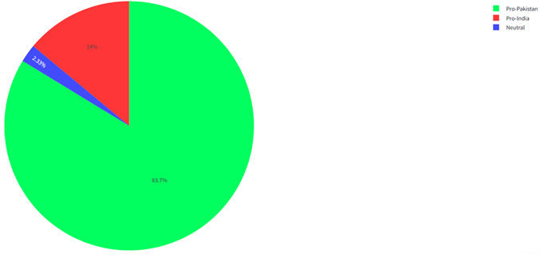
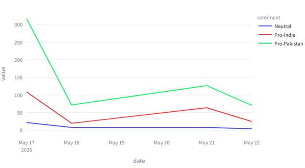
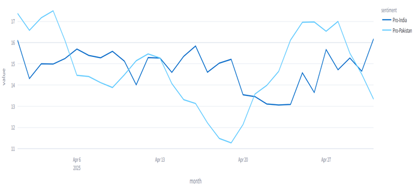
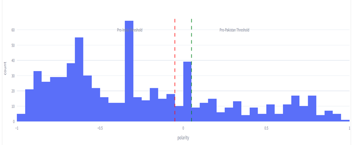
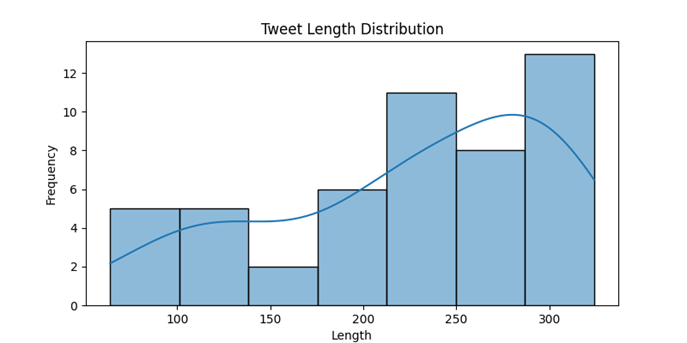
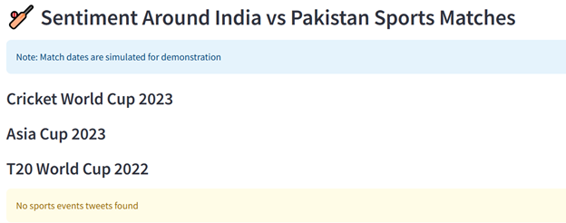
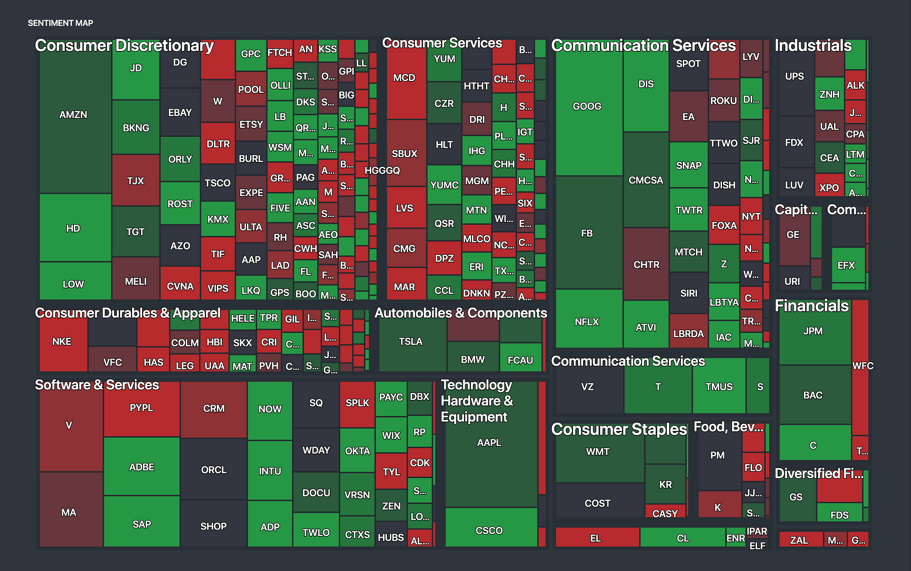

# 📊 Mining Twitter for Indo-Pak Sentiment

> *"Voices of the Subcontinent leverages an NLP and VADER-based approach to track sentiment trends in digital diplomacy."*


---

## 🧠 Project Overview

This project is a sentiment analysis system that extracts, processes, and visualizes public sentiment on Twitter around the **socio-political and cultural dynamics between India and Pakistan**.

Built using:
- **Python** for scripting
- **NLP + VADER** for sentiment analysis
- **Supabase** for cloud database
- **Plotly + Streamlit** for interactive visualizations

---

## 🎯 Project Goals

- ✅ Scrape live and historical tweets about Indo-Pak relations
- ✅ Clean and preprocess tweet data
- ✅ Classify tweets using VADER into **positive**, **negative**, and **neutral**
- ✅ Store structured results in Supabase
- ✅ Display interactive dashboards via Streamlit

---

## 🌐 Problem Statement

Despite high volumes of Indo-Pak discourse on Twitter, there's **no real-time system** to:
- Classify public sentiment across borders
- Compare sentiment before vs after major events
- Analyze emotion categories (anger, joy, fear, pride)
- Track public vs media bias

---

## 📦 Features Breakdown

| Feature                          | Description                                                                 |
|----------------------------------|-----------------------------------------------------------------------------|
| 🐦 Tweet Scraping                | Twitter API v2 + Bearer Token authentication                               |
| 🧹 Text Preprocessing            | Lowercasing, lemmatization, emoji decoding, hashtag & URL removal          |
| 🤖 Sentiment Classification      | Rule-based VADER sentiment scoring                                         |
| 🧠 Emotion Detection (optional)  | Fear, Anger, Joy, Sadness via lexicons                                     |
| 📊 Visualization                 | Plotly charts inside a responsive Streamlit dashboard                      |
| 🧾 Data Storage                  | Supabase SQL Database for tweets and metadata                              |
| 📌 Analytical Filters            | Date, gender, region, hashtags, sports events, political topics, etc.      |

---

## 🔁 System Pipeline


1. **Scrape tweets** based on hashtags: `#India`, `#Pakistan`, `#Kashmir`, etc.
2. **Preprocess tweets** with `NLTK`, `regex`, emoji decoding
3. **Run VADER analysis**
4. **Store results** in Supabase
5. **Visualize trends** with Plotly on Streamlit

---

## 🏗️ app.py Structure

```bash
app.py
├── streamlit_dashboard()        # Main Streamlit UI
├── load_tweets_from_db()       # Supabase fetch logic
├── preprocess_tweet(text)      # NLP cleaning pipeline
├── analyze_sentiment(text)     # VADER sentiment logic
├── plot_sentiment_trends()     # Time-based line graphs
├── plot_hashtag_comparison()   # Hashtag-wise sentiment split
├── plot_region_analysis()      # Geo-based analysis
├── plot_sports_emotion()       # Indo-Pak cricket sentiment
└── plot_polarity_curve()       # Distribution of polarity

---

---

## 🧪 Tech Stack

| Component         | Tool/Library                          |
|------------------|---------------------------------------|
| Language          | Python 3.9+                           |
| NLP               | `nltk`, `re`, `emoji`, `vaderSentiment` |
| API               | Twitter Developer v2                  |
| Storage           | Supabase                              |
| Visualization     | `plotly`, `seaborn`, `matplotlib`     |
| Interface         | `Streamlit`                           |
| Statistical Tools | `scipy`, `statsmodels`                |

---

## 🛠️ Setup Instructions

```bash
# Clone repository
git clone https://github.com/yourusername/indo-pak-sentiment

# Install dependencies
pip install -r requirements.txt

# Add your .env file with:
# - TWITTER_BEARER_TOKEN
# - SUPABASE_URL
# - SUPABASE_KEY

# Run the app
streamlit run app.py
```

---

## 🧹 Tweet Preprocessing

Before analysis, tweets go through:
- ✅ Lowercasing
- ✅ Emoji to text (e.g., 😀 → “smile”)
- ✅ Regex cleanup (`@mentions`, `#hashtags`, `URLs`)
- ✅ Tokenization
- ✅ Stopword removal
- ✅ Lemmatization

```python
from nltk.tokenize import word_tokenize
from nltk.corpus import stopwords
from nltk.stem import WordNetLemmatizer
```

---

## 📊 Sentiment Classification (VADER)

Each tweet is scored using VADER into:

```text
compound > 0.05     → Positive  
compound < -0.05    → Negative  
Otherwise           → Neutral
```

Sample output:
```json
{'neg': 0.22, 'neu': 0.55, 'pos': 0.23, 'compound': -0.34}
```

---

## 📈 Dashboard Visuals

### 1. 📉 Sentiment Distribution


### 2. 🧨 Cross-Broder Terrorism vs National Sovereignty


### 3. ⌛ Daily Sentiment Trend


### 4. ⚖️ Diplomatic Relation


### 5. 📉📈 Polarity Ditribution


### 6. 📏 Tweet Length Distribution


### 7. 🏏 India vs Pakistan Sports Events



### 8. 🌍 Region-Wise Heatmap


### 9. 💬 Hashtag Sentiment Bubble Chart

```text
#Kashmir   → 🟥 Negative  
#Peace     → 🟩 Positive  
#Ceasefire → 🟨 Neutral
```

---

## 📂 Supabase Schema (Simplified)

```sql
Table: tweets
├── tweet_id        VARCHAR
├── user_location   TEXT
├── timestamp       TIMESTAMP
├── text_cleaned    TEXT
├── sentiment       ENUM('positive', 'neutral', 'negative')
├── compound_score  FLOAT
├── topic_tag       TEXT
```

---

## 📈 Event-Based Analysis

| Event                   | Sentiment Shift          |
|------------------------|--------------------------|
| 📰 Surgical Strike      | Surge in negative tweets |
| 🏏 Cricket Match (Asia) | Mixed but emotional      |
| 🕊️ Peace Talks         | Positive sentiment rise  |
| 💥 Ceasefire Violation  | Sharp negative spike     |

---


---

## 🔬 Statistical Testing

| Comparison                    | Test Used       |
|------------------------------|-----------------|
| Male vs Female sentiment      | Z-Test          |
| Pre vs Post event sentiment   | T-Test          |
| India vs Pakistan polarity    | Chi-Square Test |

---

## 💡 Insights & Impact

- 🗣️ Public tweets are more emotionally extreme than media tweets  
- 📍 Border areas show higher negative sentiments  
- 🧠 Women post more neutral or peace-oriented content  
- 🧵 Sentiments around #Kashmir and #Ceasefire are the most polarized  

---

## 📣 Applications

- 📰 Media framing audits  
- 🕊️ Peacebuilding NGOs  
- 📊 Policy recommendations  
- 🔍 Academic research in sentiment & diplomacy  

---

## 🙌 Contributors
  
- **🧕🏻Syeda Rutba Eman** 
- **🧑🏻Muaz Bin Gulfam** 
- **🙉Hasan Mustafa Qureshi**  
- **👶🏻Basim Bin Sabih**  
- **🕵🏻‍♂️Syed Anas Ahmed**

Supervised by **👨🏿‍🏫Engr. Imran Alvi**  
Dawood University of Engineering & Technology – Dept. of Computer Science

---

## 📬 Contact

📧 Email: muazgulfam7890@gmail.com  
🌍 Location: Karachi, Pakistan

---

> *“In digital diplomacy, every tweet is a tool, every hashtag a headline.”*

